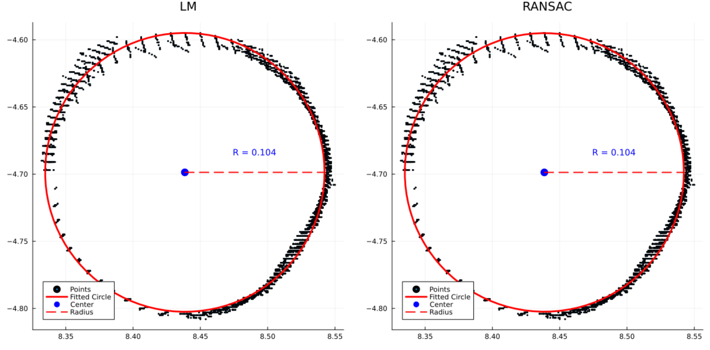
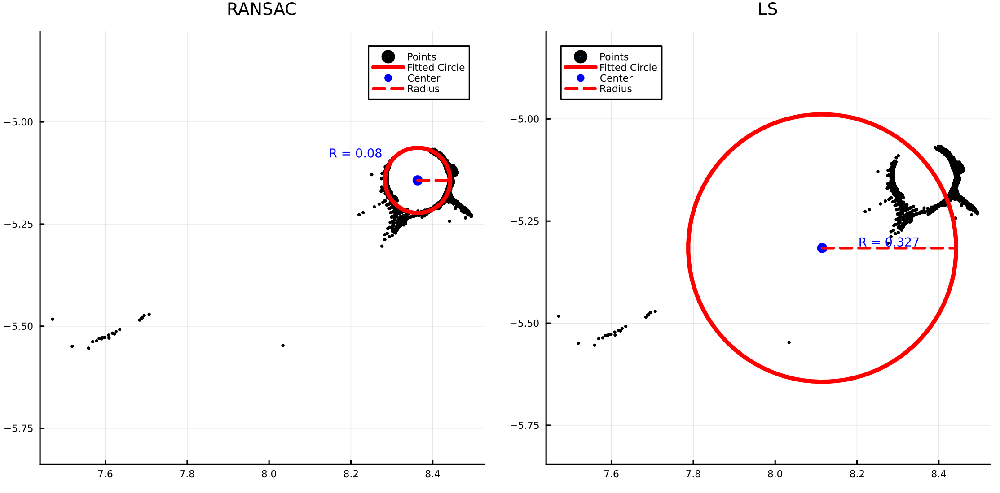

<div align="center">

# DBHFit.jl

**Professional DBH Fitting Julia Package**

[](https://julialang.org/)
[](https://opensource.org/licenses/MIT)

**English** | [**中文文档**](README_zh-CN.md)

Circle fitting algorithms for DBH (Diameter at Breast Height) and trunk diameter estimation from forestry point cloud data

</div>

---

## ✨ Features

- 🎯 **Three Algorithms** - Linear Least Squares (LS), Nonlinear Least Squares (Levenberg-Marquardt), RANSAC
- 🔧 **Unified API** - Single `fit_dbh` function interface
- 🤖 **RANSAC Optimization** - Bayesian optimization with Hyperopt.jl for automatic parameter tuning
- 📊 **Visualization** - Plots.jl visualization support

## 📦 Installation

```julia
using Pkg
Pkg.add(url="https://github.com/hunterbuffer11/DBHFit.jl")
```

## 🚀 Quick Start

```julia
using DBHFit

# Sample data
x = [0.0, 1.0, 0.0, -1.0]
y = [1.0, 0.0, -1.0, 0.0]

# Fit using least squares
result = fit_dbh(x, y; method=:ls)

println("Center: ($(result.center_x), $(result.center_y))")
println("Radius: $(result.radius)")
println("DBH: $(result.dbh)")
```

## 📖 Usage

For more examples, please refer to the [examples](/examples) directory.

### Fitting Methods

#### Linear Least Squares (LS)
```julia
result = fit_dbh(x, y; method=:ls)
```

#### Nonlinear Least Squares (LM)
```julia
result = fit_dbh(x, y; method=:lm, max_iter=50, robust=true)
# Supports Huber robust weights
```

#### RANSAC
```julia
# Manual parameters
result = fit_dbh(x, y; method=:ransac, max_trials=200,
                 min_inliers=50, threshold=0.01)

# Auto optimization
result = fit_dbh(x, y; method=:ransac, optimize=true)
# Robust to outliers, ideal for noisy data
```

### Result Type

```julia
struct CircleFitResult
    center_x::T    # Circle center X
    center_y::T    # Circle center Y
    radius::T      # Radius
    dbh::T         # DBH (2 * radius)
    rmse::T        # Root Mean Square Error
    method::Symbol # Fitting method
end
```

### Other Usage

```julia
# Point2D input
points = [Point2D(0.0, 1.0), Point2D(1.0, 0.0),
         Point2D(0.0, -1.0), Point2D(-1.0, 0.0)]
result = fit_dbh(points; method=:ls)

# Visualization
using Plots
result = fit_dbh(x, y; method=:lm)
p = plot_fit(x, y, result)
savefig(p, "fitting_result.png")
```

## 📊 Results Comparison

### Comparison of Three Fitting Methods

<div align="center">


</div>

<!-- 
Result1.png: Under good point cloud quality, the fitting results of the three methods are usually the same (using LM and RANSAC as examples).

Result2.png: In the presence of outliers, the RANSAC method can provide a more stable estimation (using LS and RANSAC as examples).
-->

## ✅ Validation

Automatic input data validation:
- Equal length vectors
- Minimum 3 points
- No NaN/Inf values
- Non-collinear points
- Non-coincident points

## 👍 Recommended Methods

- For high-quality point cloud data at breast height, Linear Least Squares (LS) is recommended
- If there are too many outliers, RANSAC is recommended. RANSAC parameters can be automatically estimated using Bayesian optimization. Controlled by `optimize=true, optimize_metric=:mae`. MAE is recommended over RMSE for more stable estimation.

## 📄 License

MIT License - see [LICENSE](LICENSE) file

## 👤 Author

Hunter

## 🙏 Acknowledgments

Thanks to the Julia community and all contributors! Feel free to point out issues or suggest improvements.
